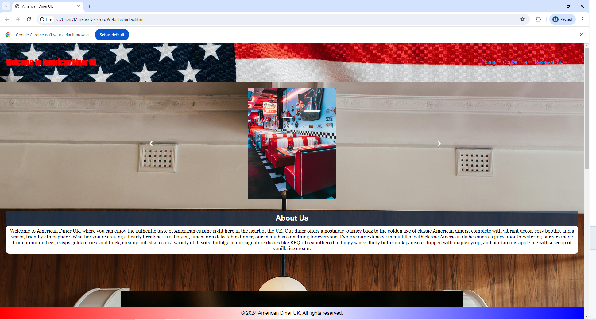

# American Diner UK

# Overview
American Diner UK is a new restaurant establishment aiming to bring the authentic American dining experience to the UK. The diner seeks to create a vibrant, welcoming, and nostalgic atmosphere reminiscent of classic American diners. To achieve this, American Diner UK requires a static website that will serve as its online presence, providing essential information to customers and facilitating reservations.

-----------------------------------
# Objectives
Showcase the Diner Experience: The website should convey the unique atmosphere and offerings of American Diner UK, attracting customers to visit the diner.

User-Friendly Navigation: Ensure the website is easy to navigate, allowing visitors to quickly find information about the diner, contact details, and make reservations.

Responsive Design: The website should be responsive, providing an optimal viewing experience across various devices, including desktops, tablets, and smartphones.

-----------------------------------
# Website Structure

# 1. Home Page
Header: Featuring the American Diner UK logo and navigation menu.

Hero Section: A high-quality image or slideshow showcasing the diner's interior, dishes, and ambiance.

Welcome Message: A brief introduction to American Diner UK, highlighting the unique dining experience and the type of cuisine offered.

Footer: Including brief copyright notice.

# 2. Contact Page
Header: Consistent with the Home page.

Contact Information: Display the diner's address, phone number, and email address.

Google Maps Embed: An interactive map showing the diner's location.

Footer: Consistent with the Home page.

# 3. Reservation Page
Header: Consistent with the Home page.

Reservation Form: A form for customers to book a table, including fields for name, contact information, date, time, and number of guests.

Footer: Consistent with the Home page.

-----------------------------------

# Design Requirements

Color Scheme: Use a color palette that reflects the classic American diner aesthetic, such as reds, whites, and blues.

Typography: Select fonts that are easy to read and evoke a diner feel, such as bold, retro-style fonts for headings and clean, modern fonts for body text.

Imagery: Utilize high-quality images that showcase the diner's interior, food, and overall atmosphere.

Accessibility: Ensure the website meets accessibility standards, providing a good experience for all users, including those with disabilities.

-----------------------------------

# Technical Requirements

Static Website: The site should be built using HTML, CSS, and JavaScript, without the need for a backend server or database.

Responsive Design: Use responsive web design techniques to ensure the website looks and functions well on all devices.

SEO: Implement basic search engine optimization (SEO) practices to help the website rank well in search engine results.

-----------------------------------

# Deliverables
Fully functional static website with Home, Contact, and Reservation pages.

Responsive design ensuring compatibility across various devices and screen sizes.

Source files and documentation for future maintenance and updates.

## Features User Experience
#### How I intended and how it turned out

__Index / Homepage__

 

On the index-page I wanted the User to have the american expereince from the start. which is why I included the american flag and kept in with the red white and blue color theme. I also wanted to make a slideshow to show some of the photos of the diner. While giving the user some text about who there are and also what kind of meals have.
__Reservation Page__

 

I wanted to make the reservation page as simpleas possible. Which is why it just has the form and a photo of the diner to keep it simple for the user 

__Contact page__

On the contact page, the User finds my email and my phonenumber, along with the address and a google map to show where it is Again wanted to keep it simple with a image of the diner interior in the background 

- __Navigation Bar__

Our full responsive navigation bar ensures smooth navigation across all pages. Here’s how it works:

1. Consistent Links: Whether you’re on the Home page, Gallery, or Contact page, the navigation bar remains identical. You’ll find direct links to each section, making it easy to switch between pages.
   
2. Mobile-Friendly: When the screen size is smaller than 768px, the navigation bar transforms into a compact bar icon. This space-saving design ensures a seamless experience even on smaller screens.

## Testing 

I used W3schools to validate the code

The Webpage is responsive on all web-browsers i have tested it in, even the subscription-form on the contact page is working properly. Microsoft Edge, Chrome. 

### Functional Testing

|Function|On platform|Works good| Fails|
|--------|-----------|----------|------|
|Logotype to home|browsers *| Yes |      |
|nav Home|browsers * |Yes|      |
|nav Gallery| browsers * |Yes |      |
|nav Contact |browsers *|Yes|      |
|Wiki-link in tips on index |  browsers *|Yes |      |
|<h4>The footer social-media links</h4>|
|X|browsers *|Yes||
|Instagram|browsers *|Yes||
|Facebook|browsers *|Yes||
Browsers *: Google Chrome, Oprah, Firefox, Microsoft Edge.

## Deployment

- The site was built on gitpod and deployed to GitHub pages.

Live site adress: [American diner websitewebsite](https://markus96.github.io/Project-1-Mark-Eddy-American-Diner-UK)

## Credits 

-I got the idea for the nav bar drop down menu using W3S
https://markus96.github.io/Project-1-Mark-Eddy-American-Diner-UK
-The slide show I got support from W3S

-The form I got support with from the love running Code institute [The Code Institute Responsive Formdump](https://formdump.codeinstitute.net/) whitin my subscription-form

-I started out making divs with paragraphs, but searched om google an found this page which gave me some tips on how to set up the gallery useing <figure> and <figurecaption>.
Medium.com
[medium.com where I found figure and figcaption](https://medium.com/frontendshortcut/how-to-make-a-polaroid-photo-gallery-in-html-and-css-d68f5a306c84)

### Content 
-The text throught the entire website on all pages, are my own.

-I have linked [Wikipedia rule of thirds](https://en.wikipedia.org/wiki/Rule_of_thirds) for the users to find a broader explenation of the "rule of thirds".

### Media

For the images I used where from a royaty free websites called [Pexels]https://www.pexels.com/ and [Unsplash]https://unsplash.com/

### Conclusion 

All in all I think that the website that I have created meats the clients needs. For a simple website that show off what the diner is and I have met what the clients needs were.

   
